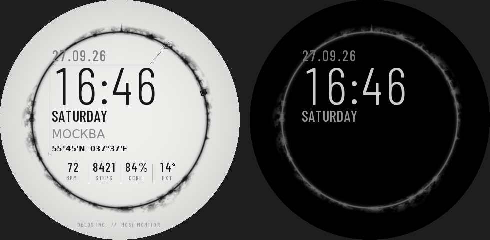

# WESTWORLD // HOST MONITOR — циферблат для Amazfit (Zepp OS)

Циферблат в стиле заставки «Мира Дикого Запада»: светлый фон, живое «дымное»
кольцо с всплесками-пиками, выносная линия с шестигранником и блок текста
узким шрифтом.



## Что на экране

| Элемент | Откуда данные |
|---|---|
| Анимированное кольцо (20 кадров, 10 fps, бесшовный цикл) | `IMG_ANIM`, останавливается при выключении экрана |
| Шестигранник, бегущий по кольцу | секундная стрелка (`TIME_POINTER`) |
| `27.09.26` — дата | `IMG_DATE` + год из JS |
| `16:46` — время | `IMG_TIME` |
| `SATURDAY` — день недели | `IMG_WEEK` |
| Город (`MOSCOW` / `UNDISCLOSED LOCATION`) | геолокация телефона через погодный сервис Zepp |
| Координаты `55°45'N 037°37'E` | GPS часов — **по тапу на город** (до 2 мин, затем GPS выключается, последняя точка запоминается). Пока координат нет — прогноз `TODAY +18° / +9°` |
| BPM / STEPS / CORE / EXT | пульс, шаги, заряд, температура на улице; тап открывает соответствующее приложение |
| AOD | чёрный фон, серое статичное кольцо, время, дата, день недели |

## Установка

Готовые пакеты лежат в корне репозитория:

* `westworld_host_480x480.zpk` — Balance, GTR 3 Pro, T-Rex 3 и др. 480×480
* `westworld_host_466x466.zpk` — GTR 4, T-Rex 3 Pro 44mm

Ставятся так же, как остальные `.zpk` из этого репозитория (режим разработчика
в Zepp → сканирование QR / сторонний загрузчик).

## Сборка из исходников

```bash
pip install pillow numpy
python3 tools/gen.py          # генерирует все картинки в assets/ и watchface/metrics.js
python3 tools/preview.py 480  # мокап + GIF анимации в preview/
npm i -g @zeppos/zeus-cli
zeus build                    # dist/*.zab (внутри — .zpk для каждого разрешения)
```

Всё оформление настраивается в `tools/gen.py` (радиус кольца, пики, шрифт,
раскладка `LAYOUT`), логика — в `watchface/index.js`.

Шрифт: Barlow Condensed (SIL Open Font License, `tools/OFL-BarlowCondensed.txt`).
